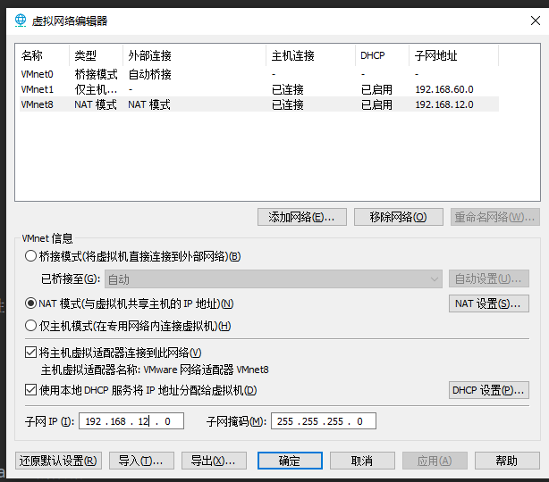

#### 需要的软件：
vmware 15.5及以上的版本。

1.打开解压后的文件夹，找到.vmx结尾的文件
2.菜单--编辑--虚拟网络编辑器--找到NAT模式的连接方式(与虚拟机共享主机ip地址)

3.配置子网ip  192.168.222.0
4.DHCP设置 192.168.222.128 ~ 192.168.222.254
5.NAT设置  192.168.222.2
6.开启虚拟机，运行

8.用户名:root 密码:123456 (ifconfig服务器已经配置好的地址： 192.168.222.132)
9.kafka所在的位置：/home/kafka_2.12-2.7.0
10.添加kafka的环境变量，编辑 vim /etc/profile
11.在打开的文件里面添加一行信息
export KAFKA=/home/kafka_2.12-2.7.0
12.刷新系统的环境变量
source /etc/profile

KAFKA
开源的分布式的流处理平台，具有高吞吐量、可扩展性和容错性，被广泛的应用于构建实时数据流的系统。

-- 消息：基本的数据单元，也就是一行行的数据。
-- 主题：topic。将数据分类进行存储的逻辑概念。
-- 生产者：负责将数据发送到kafka的主题。
-- 消费者：从kafka获取和读取数据的其他工具和组件等。
-- 消费者组：多个消费者可以组成一个消费者组并行的消费kafka的数据。
-- 分区：每个主题都可以被分成多个区，每个区都是一个有序的消息日志。

启动kafka的服务：
kafka的分布式通过zookeeper的方式实现的。
1.先启动zookeeper服务：
$KAFKA 等价于 /home/kafka_2.12-2.7.0
$KAFKA/bin/zookeeper-server-start.sh $KAFKA/config/zookeeper.properties >> zookeeper.log &
cat /home/kafka_2.12-2.7.0/zookeeper.log 查看zk日志

2.再启动kafka服务：
$KAFKA/bin/kafka-server-start.sh $KAFKA/config/server.properties >> kafka.log &
3.检查启动是否成功  jps

QuorumPeerMain	zookeeper服务启动成功的标志
Kafka			kafka服务启动成功的标志

4.新建一个主题
sh $KAFKA/bin/kafka-topics.sh  --create  --topic  test-topic  --partitions 1  --replication-factor 1  --bootstrap-server  192.168.222.132:9092
5.检查自己是否有某个主题
sh $KAFKA/bin/kafka-topics.sh  --bootstrap-server  192.168.222.132:9092  --describe  --topic  test-topic
6.启动一个生产者，这里是用kafka把自己当成生产者
sh $KAFKA/bin/kafka-console-producer.sh  --broker-list  192.168.222.132:9092  --topic  test-topic
7.启动一个消费者窗口
sh $KAFKA/bin/kafka-console-consumer.sh  --bootstrap-server  192.168.222.132:9092  --topic  test-topic

在flink中去消费kafka的数据：
1.先添加kafka的相关依赖：pom.xml
```xml
<dependency>
    <groupId>org.apache.flink</groupId>
    <artifactId>flink-streaming-java</artifactId>
    <version>${flink.version}</version>
</dependency>

<dependency>
    <groupId>org.apache.flink</groupId>
    <artifactId>flink-connector-kafka</artifactId>
    <version>${flink.version}</version>
</dependency>
```
